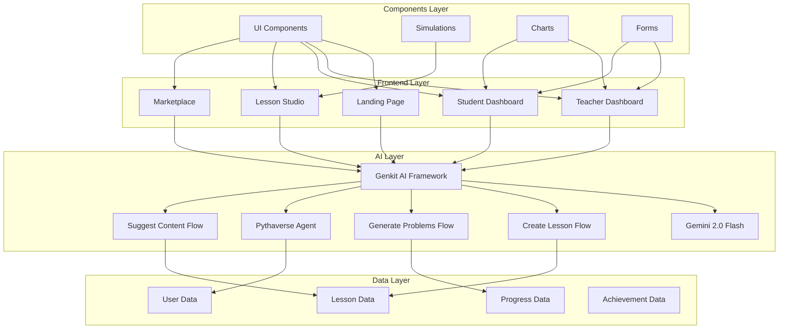
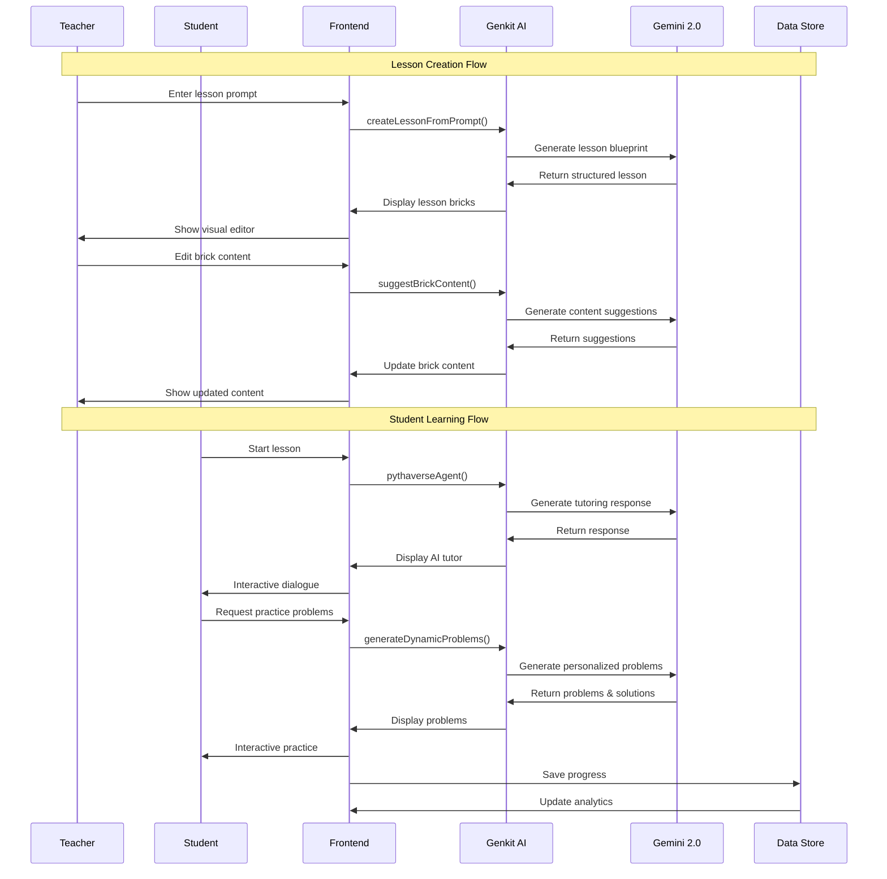
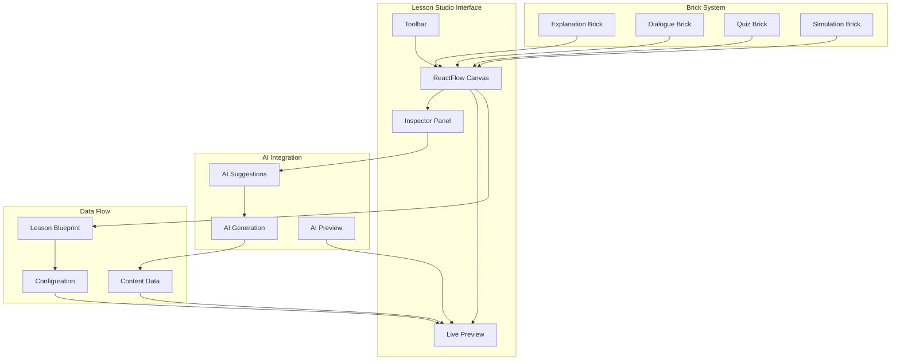
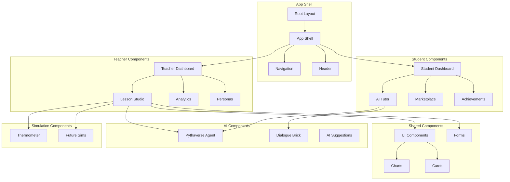
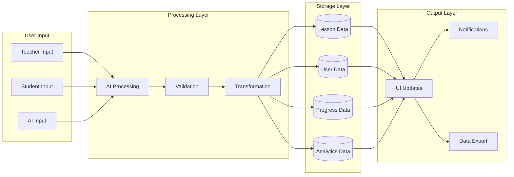
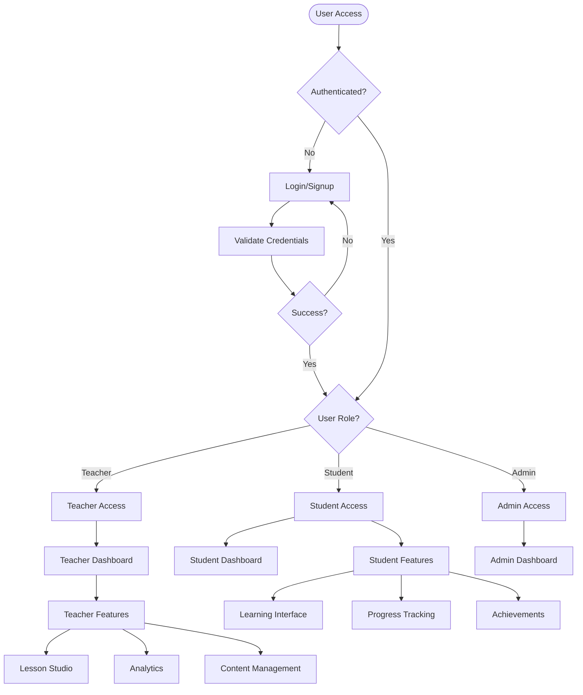
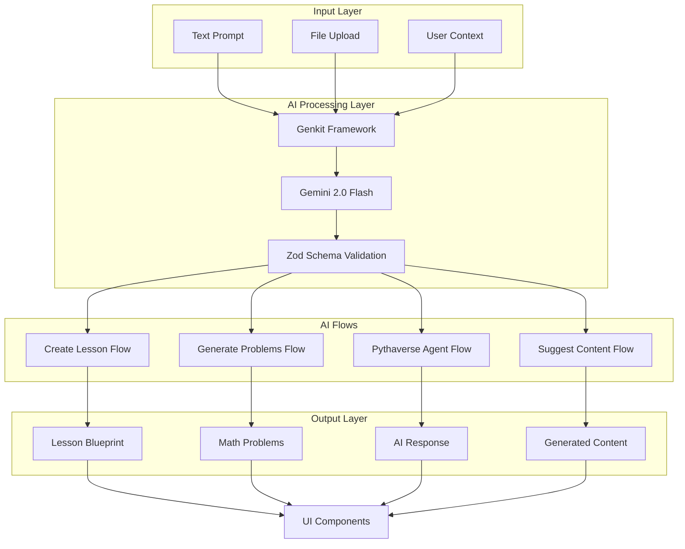
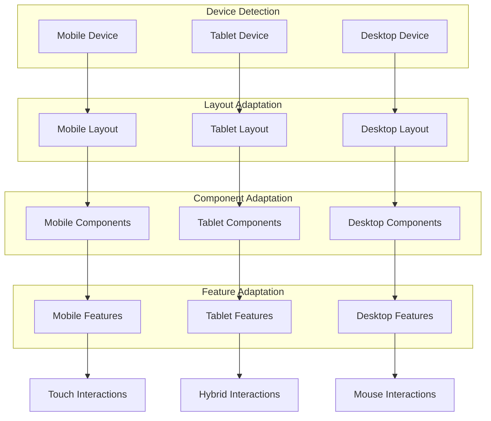
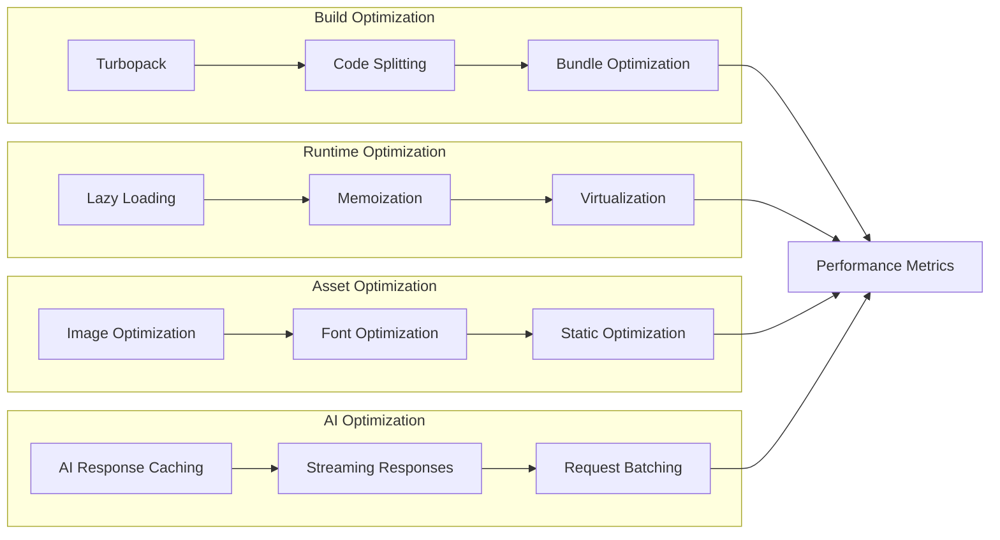

# MathMinds Design Flow Diagrams

## 1. Application Architecture Overview

## 2. User Journey Flow

## 3. AI Integration Flow

## 4. Lesson Studio Component Flow

## 5. Component Architecture

## 6. Data Flow Architecture

## 7. Authentication & Authorization Flow

## 8. AI Flow Detailed Architecture

## 9. Responsive Design Flow

## 10. Performance Optimization Flow

These diagrams provide a comprehensive view of the MathMinds application's design flow, covering architecture, user journeys, AI integration, component structure, data flow, authentication, responsive design, and performance optimization. Each diagram focuses on different aspects of the system to help understand the overall design and implementation approach. 

## **Created Design Flow Diagrams:**

### **1. Application Architecture Overview**
- Shows the layered architecture with Frontend, AI, Data, and Components layers
- Illustrates how different parts of the system interact

### **2. User Journey Flow**
- Maps the complete user experience for both teachers and students
- Shows decision points and user pathways through the application

### **3. AI Integration Flow**
- Detailed sequence diagram showing how AI processes user requests
- Covers both lesson creation and student learning flows

### **4. Lesson Studio Component Flow**
- Visualizes the ReactFlow-based lesson builder
- Shows how the brick system and AI integration work together

### **5. Component Architecture**
- Hierarchical view of all major components
- Shows relationships between different component categories

### **6. Data Flow Architecture**
- Illustrates how data moves through the system
- Shows input, processing, storage, and output layers

### **7. Authentication & Authorization Flow**
- User access control and role-based permissions
- Security flow from login to feature access

### **8. AI Flow Detailed Architecture**
- Deep dive into the AI processing pipeline
- Shows how Genkit and Gemini work together

### **9. Responsive Design Flow**
- How the application adapts to different devices
- Component and feature adaptation strategies

### **10. Performance Optimization Flow**
- Build-time and runtime optimizations
- Asset and AI response optimization strategies

These diagrams provide a comprehensive visual representation of:
- **System Architecture**: How all components fit together
- **User Experience**: Complete user journeys and interactions
- **AI Integration**: Detailed AI processing workflows
- **Data Management**: How data flows through the system
- **Performance**: Optimization strategies and techniques

The diagrams use standard Mermaid syntax and can be rendered in any Mermaid-compatible viewer, making them perfect for documentation, presentations, or development team communication.
