# MathMind Project Design & Architecture

## Overview
MathMind is a sophisticated AI-powered educational platform built with Next.js 15, featuring an advanced simulation system with AI-powered improvement capabilities, dynamic component generation, and a comprehensive lesson building studio.

## **Current Application State**

MathMind has evolved into a highly sophisticated AI-powered educational platform with the following key architectural highlights:

### **AI-First Design with Advanced Simulation System**
- **AI-Powered Simulation Generation**: Complete simulation creation from text prompts
- **AI-Powered Simulation Improvement**: Iterative improvement system based on teacher feedback
- **Dynamic Component System**: Runtime generation and loading of React components
- **Multi-Agent Architecture**: Specialized AI agents for different educational tasks

### **Advanced Simulation Management**
- **Dynamic Simulation Registry**: Real-time registration and loading of AI-generated simulations
- **Server-Side Storage**: Persistent storage of simulations and component code
- **Component Code Generation**: AI generates complete React/TypeScript components
- **Simulation Improvement Pipeline**: Teacher feedback → AI analysis → Improved simulation

### **Modern Tech Stack**
- **Next.js 15** with App Router and server actions
- **TypeScript** with strict typing throughout
- **Google AI Gemini 2.0 Flash** via Genkit framework
- **ReactFlow** for visual lesson building
- **Tailwind CSS** with comprehensive design system

## Technology Stack

### Core Technologies
- **Framework**: Next.js 15.3.3 with App Router
- **Language**: TypeScript 5 with strict mode
- **Styling**: Tailwind CSS 3.4.1 with custom design system
- **UI Components**: Radix UI primitives with shadcn/ui components
- **AI Integration**: Google AI (Gemini 2.0 Flash) via Genkit framework
- **State Management**: React hooks and server actions
- **Flow Editor**: ReactFlow for lesson building
- **Charts**: Recharts for data visualization
- **Forms**: React Hook Form with Zod validation

### Key Dependencies
- **AI/ML**: `@genkit-ai/googleai`, `@genkit-ai/next`, `genkit`
- **UI Framework**: `@radix-ui/*` components, `lucide-react` icons
- **Forms**: `react-hook-form`, `@hookform/resolvers`, `zod`
- **Flow Editor**: `reactflow`, `react-use-measure`
- **Charts**: `recharts`
- **Utilities**: `clsx`, `tailwind-merge`, `date-fns`

## Project Architecture

### Directory Structure

```
MathMind/
├── src/
│   ├── ai/                          # AI/ML functionality
│   │   ├── agents/                  # Specialized AI agents
│   │   │   ├── simulation-agent.ts  # Simulation brick generation
│   │   │   ├── quiz-agent.ts        # Quiz generation
│   │   │   ├── dialogue-agent.ts    # Dialogue generation
│   │   │   ├── explanation-agent.ts # Explanation generation
│   │   │   └── title-agent.ts       # Lesson title generation
│   │   ├── flows/                   # Genkit AI flows
│   │   │   ├── create-lesson-from-prompt.ts
│   │   │   ├── generate-dynamic-problems.ts
│   │   │   ├── generate-simulation.ts
│   │   │   ├── improve-simulation-from-feedback.ts
│   │   │   ├── pythaverse-agent.ts
│   │   │   └── suggest-brick-content.ts
│   │   ├── dev.ts                   # Development AI setup
│   │   └── genkit.ts                # Genkit configuration
│   ├── app/                         # Next.js App Router pages
│   │   ├── api/                     # API routes
│   │   │   ├── create-lesson/       # Lesson creation API
│   │   │   ├── generate-simulation/ # Simulation generation API
│   │   │   ├── improve-simulation/  # Simulation improvement API
│   │   │   ├── load-simulations/    # Simulation loading API
│   │   │   ├── save-component/      # Component storage API
│   │   │   └── save-simulation/     # Simulation storage API
│   │   ├── (auth)/                  # Authentication pages
│   │   │   ├── login/
│   │   │   └── signup/
│   │   ├── educators/               # Educator landing page
│   │   ├── pricing/                 # Pricing page
│   │   ├── students/                # Student landing page
│   │   ├── teacher/                 # Teacher dashboard & tools
│   │   │   ├── analytics/           # Analytics dashboard
│   │   │   ├── create/              # Lesson creation
│   │   │   ├── dashboard/           # Teacher dashboard
│   │   │   ├── edit/                # Lesson editing
│   │   │   ├── personas/            # AI persona management
│   │   │   ├── preview/             # Lesson preview
│   │   │   ├── publish/             # Lesson publishing
│   │   │   └── studio/              # Visual lesson builder
│   │   ├── student/                 # Student learning interface
│   │   │   ├── achievements/        # Student achievements
│   │   │   ├── dashboard/           # Student dashboard
│   │   │   ├── marketplace/         # Content marketplace
│   │   │   └── tutor/               # AI tutoring sessions
│   │   ├── globals.css              # Global styles
│   │   ├── layout.tsx               # Root layout
│   │   └── page.tsx                 # Landing page
│   ├── components/                  # Reusable components
│   │   ├── shared/                  # Shared components
│   │   │   ├── app-shell.tsx        # Main app layout
│   │   │   ├── auth-form.tsx        # Authentication forms
│   │   │   ├── dialogue-brick.tsx   # Dialogue component
│   │   │   ├── header.tsx           # Site header
│   │   │   ├── lesson-card.tsx      # Lesson display cards
│   │   │   ├── progress-chart.tsx   # Progress visualization
│   │   │   └── pythaverse-agent.tsx # AI agent interface
│   │   ├── simulations/             # Interactive simulations
│   │   │   ├── generated/           # AI-generated simulations
│   │   │   │   ├── index.ts         # Dynamic component registry
│   │   │   │   └── *.tsx            # Generated simulation files
│   │   │   ├── custom-simulation.tsx # Custom simulation wrapper
│   │   │   ├── dynamic-simulation.tsx # Dynamic component loader
│   │   │   ├── enhanced-thermometer.tsx # Enhanced thermometer
│   │   │   ├── fallback-simulation.tsx # Fallback simulation
│   │   │   ├── fraction-visualizer.tsx # Fraction visualization
│   │   │   └── thermometer.tsx      # Basic thermometer
│   │   ├── studio/                  # Lesson building tools
│   │   │   ├── brick-nodes.tsx      # Flow editor nodes
│   │   │   ├── debug-view.tsx       # AI debugging interface
│   │   │   ├── lesson-studio.tsx    # Main studio component
│   │   │   └── simulation-creator.tsx # Simulation creation UI
│   │   ├── ui/                      # Base UI components (shadcn/ui)
│   │   │   ├── accordion.tsx
│   │   │   ├── alert-dialog.tsx
│   │   │   ├── button.tsx
│   │   │   ├── card.tsx
│   │   │   ├── dialog.tsx
│   │   │   ├── form.tsx
│   │   │   ├── input.tsx
│   │   │   ├── select.tsx
│   │   │   ├── tabs.tsx
│   │   │   └── ... (30+ components)
│   │   └── logo.tsx                 # Application logo
│   ├── data/                        # Static data and mock content
│   │   ├── index.ts                 # Data exports
│   │   ├── lessons.json             # Sample lesson data
│   │   └── pricing.json             # Pricing information
│   ├── hooks/                       # Custom React hooks
│   │   ├── use-mobile.tsx           # Mobile detection
│   │   └── use-toast.ts             # Toast notifications
│   └── lib/                         # Utility libraries
│       ├── client-storage.ts        # Client-side storage utilities
│       ├── server-storage.ts        # Server-side storage utilities
│       ├── simulation-registry.ts   # Simulation registry singleton
│       ├── types.ts                 # TypeScript type definitions
│       └── utils.ts                 # Utility functions
├── data/                            # Server-side data storage
│   ├── components/                  # Generated component storage
│   ├── lessons.json                 # Lesson data
│   └── simulations.json             # Simulation data
├── docs/                            # Documentation
├── blueprint.md                     # Project requirements
├── components.json                  # shadcn/ui configuration
├── next.config.ts                   # Next.js configuration
├── package.json                     # Dependencies and scripts
├── postcss.config.mjs               # PostCSS configuration
├── tailwind.config.ts               # Tailwind CSS configuration
└── tsconfig.json                    # TypeScript configuration
```

## Core Features & Components

### 1. AI-Powered Simulation System
**Location**: `src/ai/flows/` and `src/ai/agents/`

#### **Simulation Generation**
- **`generate-simulation.ts`**: Creates complete simulations from text prompts
- **`simulation-agent.ts`**: Specialized agent for simulation brick generation
- **Dynamic Component Creation**: AI generates complete React/TypeScript components
- **Registry Integration**: Automatic registration in simulation registry

#### **Simulation Improvement**
- **`improve-simulation-from-feedback.ts`**: AI-powered simulation improvement
- **Teacher Feedback Processing**: Analyzes feedback and generates improvements
- **Iterative Enhancement**: Up to 3 improvement attempts per simulation
- **Context Preservation**: Maintains original educational focus while improving

#### **AI Agents**
- **`simulation-agent.ts`**: Simulation brick generation and selection
- **`quiz-agent.ts`**: Quiz question generation
- **`dialogue-agent.ts`**: Interactive dialogue creation
- **`explanation-agent.ts`**: Educational content explanation
- **`title-agent.ts`**: Lesson title generation

### 2. Dynamic Simulation Management
**Location**: `src/components/simulations/` and `src/lib/`

#### **Simulation Registry**
- **`simulation-registry.ts`**: Centralized simulation management
- **Dynamic Loading**: Runtime loading of AI-generated simulations
- **Server Storage Integration**: Persistent storage with fallback
- **Component Resolution**: Automatic component assignment based on type

#### **Generated Components**
- **`generated/index.ts`**: Dynamic component registry
- **`dynamic-simulation.tsx`**: Runtime component loader
- **`custom-simulation.tsx`**: Custom simulation wrapper
- **Auto-Registration**: Generated components automatically registered

#### **Built-in Simulations**
- **`thermometer.tsx`**: Temperature-based math concepts
- **`enhanced-thermometer.tsx`**: Advanced thermometer with features
- **`fraction-visualizer.tsx`**: Fraction visualization tool
- **`fallback-simulation.tsx`**: Fallback for missing simulations

### 3. API Infrastructure
**Location**: `src/app/api/`

#### **Simulation APIs**
- **`/api/generate-simulation`**: AI-powered simulation generation
- **`/api/improve-simulation`**: Simulation improvement with feedback
- **`/api/load-simulations`**: Load simulations from server storage
- **`/api/save-simulation`**: Save simulations to server storage
- **`/api/save-component`**: Store generated component code

#### **Lesson APIs**
- **`/api/create-lesson`**: Complete lesson generation with AI
- **Multi-Agent Integration**: Uses specialized agents for each brick type

### 4. Server-Side Storage
**Location**: `src/lib/server-storage.ts`

#### **Simulation Storage**
- **File-Based Storage**: JSON files for simulations and lessons
- **Component Storage**: Separate storage for generated component code
- **Data Persistence**: Server-side persistence with client fallback
- **Storage Management**: Add, update, and retrieve simulations

### 5. Visual Lesson Builder (Studio)
**Location**: `src/components/studio/` and `src/app/teacher/studio/`

#### **ReactFlow Integration**
- **Drag-and-Drop**: Visual lesson building interface
- **Brick System**: Four types of learning components
- **Real-time Preview**: Live lesson preview during creation
- **AI Integration**: Content suggestions and auto-generation

#### **Brick Types**
- **Explanation**: Text-based educational content
- **Dialogue**: Interactive AI conversations
- **Quiz**: Assessment questions with AI generation
- **Simulation**: Interactive visualizations with AI creation

#### **Simulation Creator**
- **`simulation-creator.tsx`**: UI for creating new simulations
- **AI-Powered Generation**: Generate simulations from descriptions
- **Parameter Configuration**: Customize simulation parameters
- **Learning Objectives**: Define educational goals

### 6. User Interface System
**Location**: `src/components/ui/` and `src/components/shared/`

#### **Design System**
- **Color Palette**: Custom blue/cyan theme with dark mode support
- **Typography**: Space Grotesk for headlines, Inter for body text
- **Component Library**: 30+ reusable UI components
- **Responsive Design**: Mobile-first approach

#### **Shared Components**
- **`app-shell.tsx`**: Main application layout
- **`header.tsx`**: Site navigation and branding
- **`lesson-card.tsx`**: Lesson display and interaction
- **`progress-chart.tsx`**: Data visualization
- **`pythaverse-agent.tsx`**: AI agent interface

## Data Flow Architecture

### Simulation Creation Flow
1. **Teacher Input**: Description of desired simulation
2. **AI Generation**: `generate-simulation.ts` creates complete simulation
3. **Component Creation**: AI generates React/TypeScript component code
4. **File Storage**: Component saved to `src/components/simulations/generated/`
5. **Registry Update**: Component registered in dynamic registry
6. **Server Storage**: Simulation metadata saved to server storage
7. **Studio Integration**: Available in lesson studio for use

### Simulation Improvement Flow
1. **Teacher Feedback**: Rating and comments on simulation
2. **AI Analysis**: `improve-simulation-from-feedback.ts` analyzes feedback
3. **Original Code Loading**: Loads original simulation component code
4. **Context Preservation**: Maintains educational focus and objectives
5. **Component Generation**: Creates improved React component
6. **File Creation**: Saves new component to generated directory
7. **Registry Update**: Registers improved component
8. **Storage Update**: Updates server storage with new simulation

### Lesson Creation Flow
1. **Teacher Prompt**: Text description of lesson
2. **Title Generation**: `title-agent.ts` generates lesson title
3. **Brick Generation**: Specialized agents create each brick type
   - **Explanation**: `explanation-agent.ts`
   - **Dialogue**: `dialogue-agent.ts`
   - **Simulation**: `simulation-agent.ts`
   - **Quiz**: `quiz-agent.ts`
4. **Studio Integration**: Bricks available in visual editor
5. **Preview & Edit**: Real-time preview and editing
6. **Publishing**: Save and publish lesson

## AI Integration Architecture

### Genkit Framework
- **Model**: Google AI Gemini 2.0 Flash
- **Flows**: Structured AI workflows with input/output schemas
- **Server Actions**: Next.js server-side AI processing
- **Type Safety**: Zod schema validation throughout

### AI Capabilities
- **Content Generation**: Dynamic lesson and simulation creation
- **Problem Generation**: Personalized math problems
- **Conversational AI**: Interactive tutoring and dialogue
- **Content Improvement**: Iterative enhancement based on feedback
- **Code Generation**: Complete React component creation

### AI Agents
Each agent specializes in a specific educational task:
- **Simulation Agent**: Creates and improves interactive simulations
- **Quiz Agent**: Generates assessment questions
- **Dialogue Agent**: Creates interactive conversations
- **Explanation Agent**: Generates educational content
- **Title Agent**: Creates lesson titles

## Simulation System Architecture

### Dynamic Component System
```
┌─────────────────┐    ┌──────────────────┐    ┌─────────────────┐
│   AI Generation │───▶│  Component Code  │───▶│  File Storage   │
└─────────────────┘    └──────────────────┘    └─────────────────┘
         │                       │                       │
         ▼                       ▼                       ▼
┌─────────────────┐    ┌──────────────────┐    ┌─────────────────┐
│  Registry Entry │    │  Dynamic Loader  │    │  React Component│
└─────────────────┘    └──────────────────┘    └─────────────────┘
         │                       │                       │
         ▼                       ▼                       ▼
┌─────────────────┐    ┌──────────────────┐    ┌─────────────────┐
│  Studio Access  │    │  Runtime Loading │    │  User Interface │
└─────────────────┘    └──────────────────┘    └─────────────────┘
```

### Simulation Registry
- **Singleton Pattern**: Centralized simulation management
- **Dynamic Loading**: Runtime component resolution
- **Server Integration**: Fallback to server storage
- **Type Safety**: Full TypeScript integration

### Component Generation
- **AI-Powered**: Complete React component creation
- **TypeScript**: Full type safety and interfaces
- **Tailwind CSS**: Consistent styling
- **Educational Focus**: Maintains learning objectives

## Development Workflow

### Scripts
- `npm run dev`: Development server with Turbopack
- `npm run genkit:dev`: AI development server
- `npm run build`: Production build
- `npm run lint`: Code linting
- `npm run typecheck`: TypeScript validation

### Configuration
- **Next.js**: Optimized for performance and SEO
- **TypeScript**: Strict type checking enabled
- **Tailwind**: Custom design system integration
- **ESLint**: Code quality enforcement

## Deployment & Hosting

### Environment Setup
- **Port**: 9002 (development)
- **Build**: Optimized for production deployment
- **Static Assets**: Optimized image handling
- **API Routes**: Server-side AI processing

### Performance Optimizations
- **Turbopack**: Fast development builds
- **Code Splitting**: Automatic route-based splitting
- **Image Optimization**: Next.js image optimization
- **Bundle Analysis**: Optimized dependency management

## Future Enhancements

### Planned Features
- **Advanced Analytics**: Detailed learning insights and progress tracking
- **Collaborative Features**: Multi-user lesson creation and sharing
- **Mobile App**: Native mobile experience with offline capabilities
- **API Integration**: Third-party educational tools and LMS integration
- **Advanced AI Models**: Support for multiple AI providers and models

### Scalability Considerations
- **Database Integration**: Persistent data storage with PostgreSQL/MongoDB
- **User Authentication**: Secure user management with OAuth
- **Content Management**: Advanced lesson organization and versioning
- **Performance Monitoring**: Real-time analytics and error tracking
- **CDN Integration**: Global content delivery for simulations

## Key Architectural Decisions

### 1. AI-First Design
- **Centralized AI Integration**: All AI functionality through Genkit
- **Specialized Agents**: Domain-specific AI agents for different tasks
- **Type Safety**: Full TypeScript integration with Zod validation
- **Server-Side Processing**: AI processing on server for security and performance

### 2. Dynamic Component System
- **Runtime Generation**: AI generates components at runtime
- **Registry Pattern**: Centralized component management
- **Fallback System**: Multiple fallback mechanisms for reliability
- **File System Integration**: Direct file system access for component storage

### 3. Simulation Improvement Pipeline
- **Iterative Enhancement**: Up to 3 improvement attempts
- **Context Preservation**: Maintains educational focus
- **Feedback Integration**: Teacher feedback drives improvements
- **Version Management**: Tracks improvement history

### 4. Server-Side Storage
- **File-Based Storage**: Simple, reliable storage solution
- **Component Persistence**: Separate storage for component code
- **Client Fallback**: LocalStorage fallback for offline capability
- **Data Consistency**: Consistent data structure across storage layers

This architecture provides a solid foundation for an AI-powered educational platform with sophisticated simulation capabilities, comprehensive AI integration, and a scalable design for future growth.

# MathMind Design Flow Diagrams

## 1. Application Architecture Overview
- Shows the layered architecture with Frontend, AI, Data, and Components layers
- Illustrates how different parts of the system interact

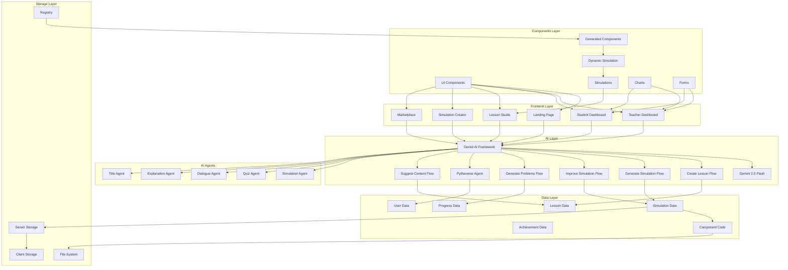

## 2. User Journey Flow

- Maps the complete user experience for both teachers and students
- Shows decision points and user pathways through the application

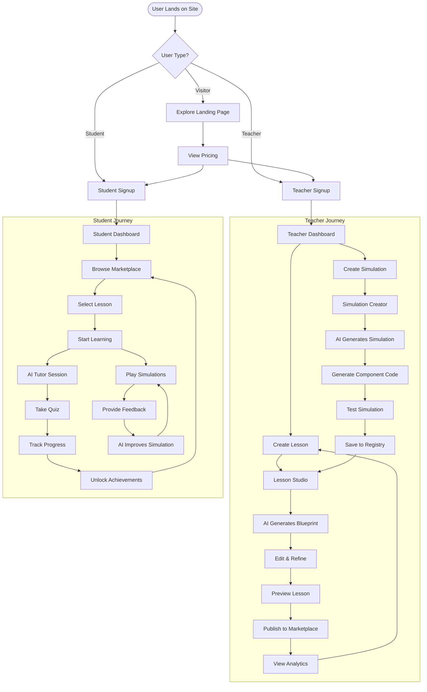

## 3. AI Integration Flow

- Detailed sequence diagram showing how AI processes user requests
- Covers lesson creation, simulation generation, and improvement flows

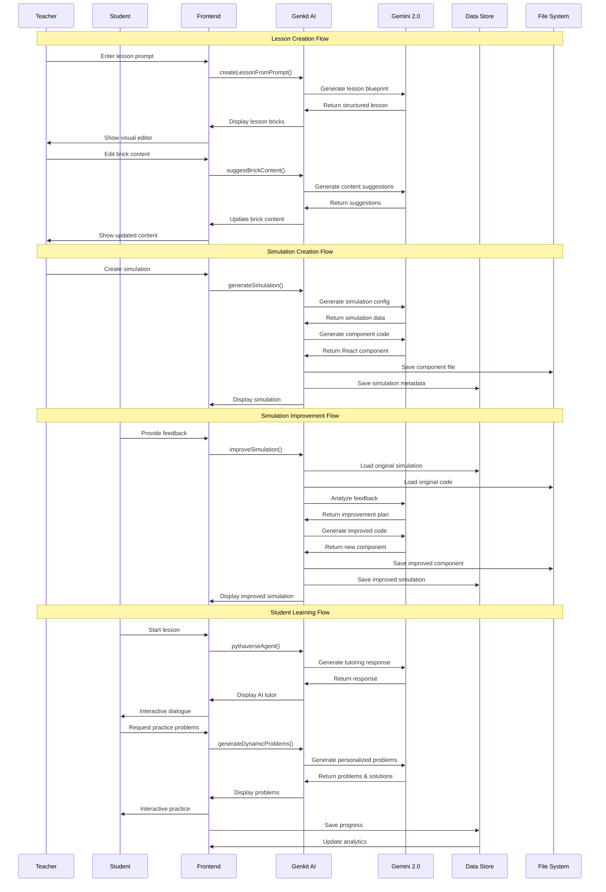

## 4. Simulation System Architecture

- Visualizes the complete simulation generation and improvement pipeline
- Shows how AI creates, stores, and improves simulations

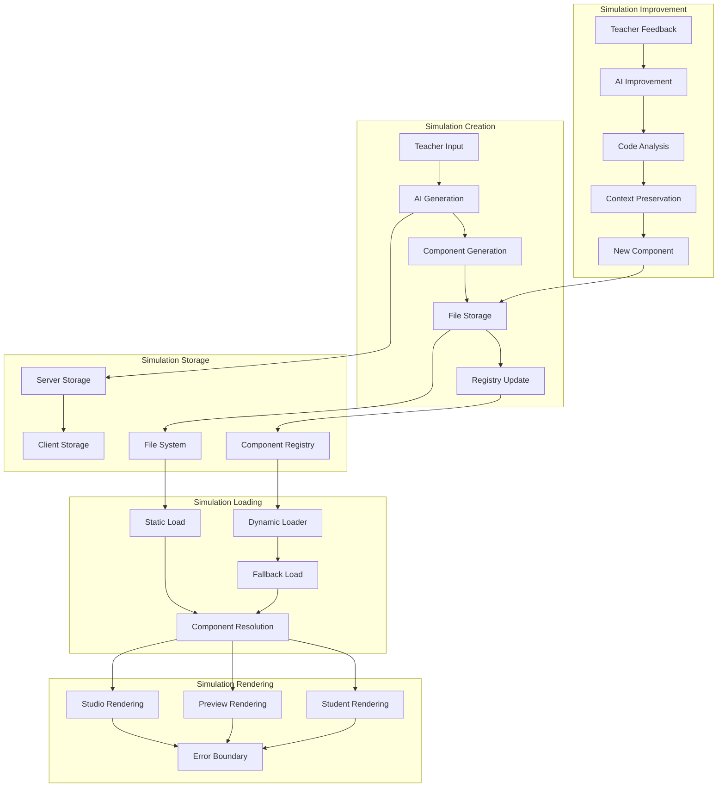

## 5. Lesson Studio Component Flow

- Visualizes the ReactFlow-based lesson builder with simulation integration
- Shows how the brick system and AI integration work together

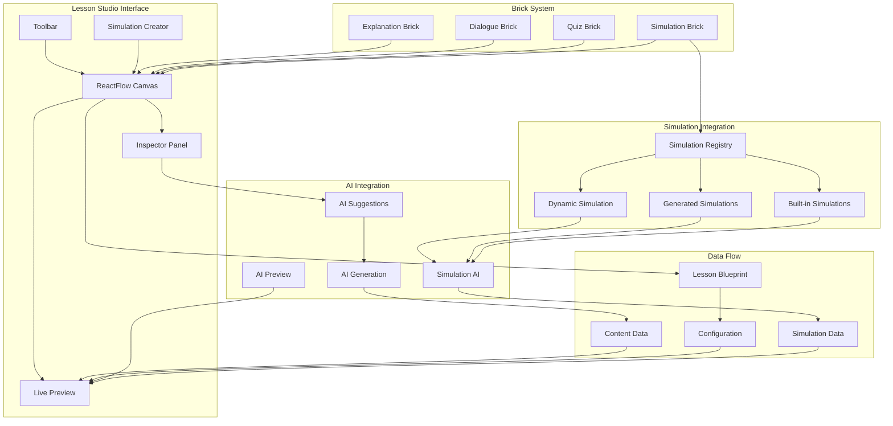

## 6. Component Architecture

- Hierarchical view of all major components
- Shows relationships between different component categories

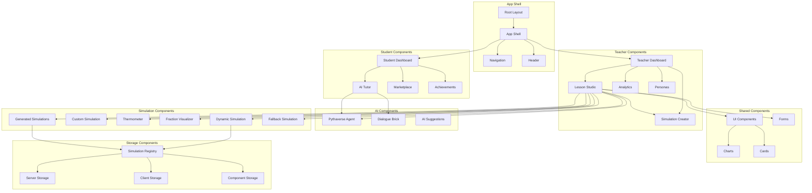

## 7. Data Flow Architecture

- Illustrates how data moves through the system
- Shows input, processing, storage, and output layers

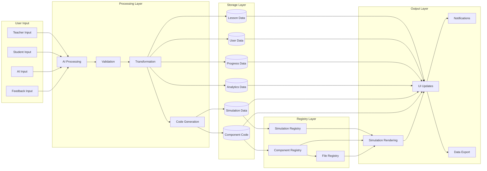

## 8. AI Flow Detailed Architecture

- Deep dive into the AI processing pipeline
- Shows how Genkit and Gemini work together with specialized agents

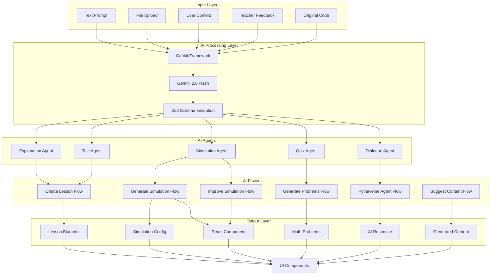

## 9. Simulation Improvement Pipeline

- Detailed flow of how simulations are improved based on feedback
- Shows the complete improvement cycle

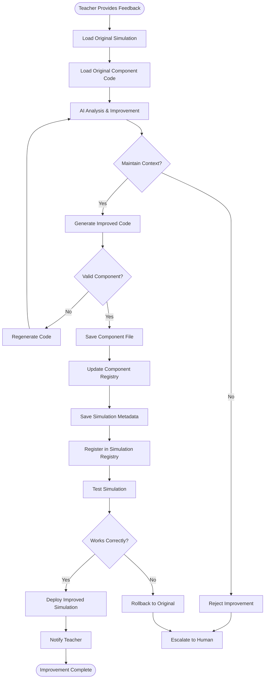

## 10. Dynamic Component Loading System

- Shows how AI-generated components are loaded and rendered
- Illustrates the fallback mechanisms and error handling

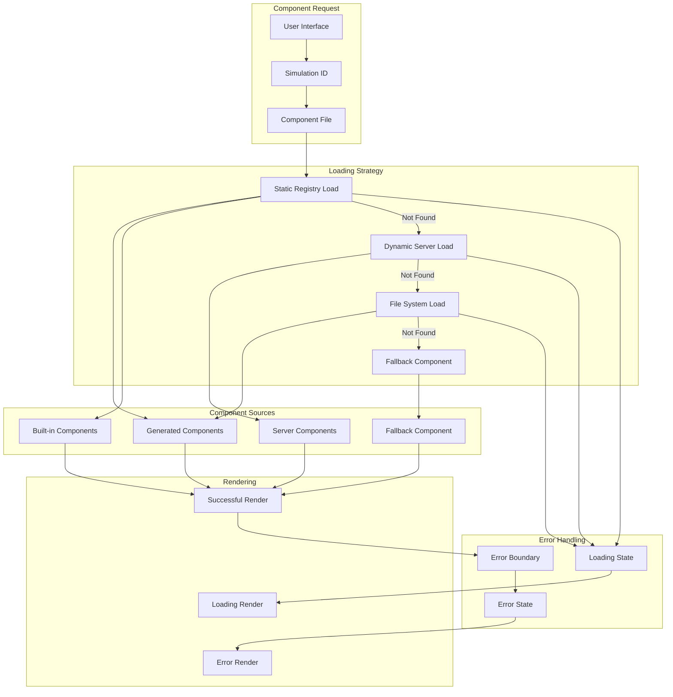

## 11. Server-Side Storage Architecture

- Illustrates the file-based storage system
- Shows how data persists across sessions

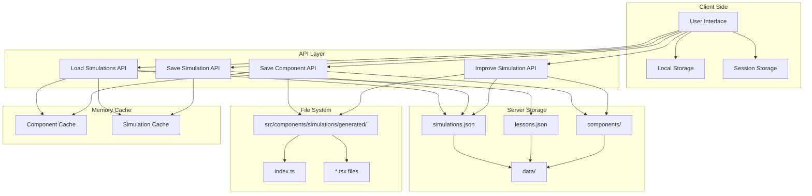

## 12. Performance Optimization Flow

- Build-time and runtime optimizations
- Asset and AI response optimization strategies

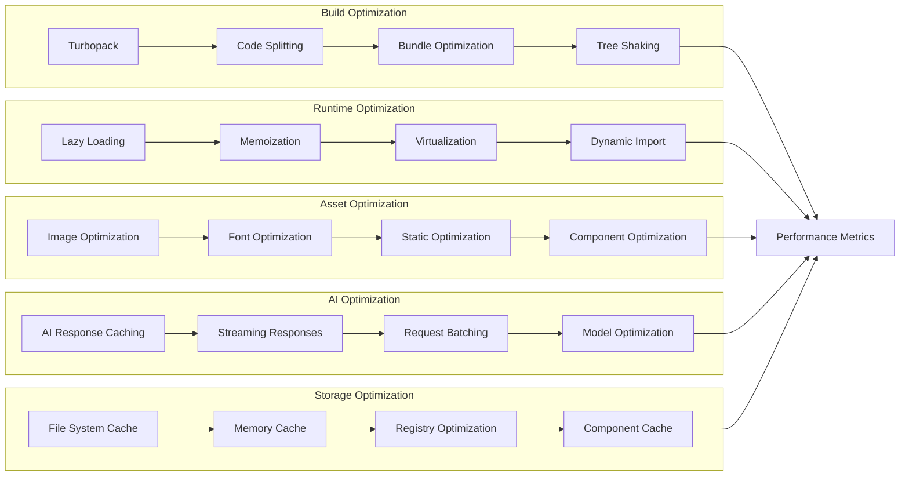

These diagrams provide a comprehensive view of the MathMind application's design flow, covering the advanced simulation system, AI integration, dynamic component loading, storage architecture, and performance optimization. Each diagram focuses on different aspects of the system to help understand the overall design and implementation approach. 
