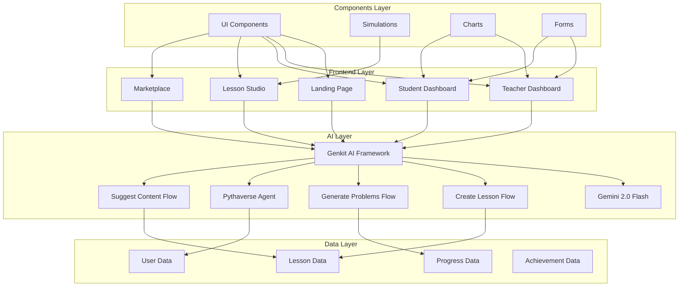
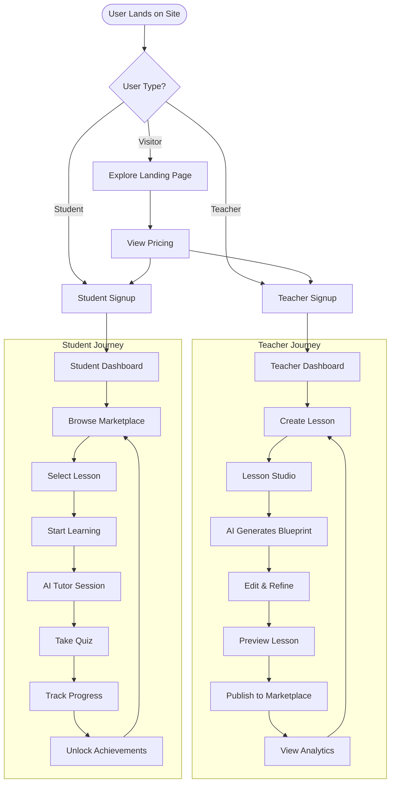
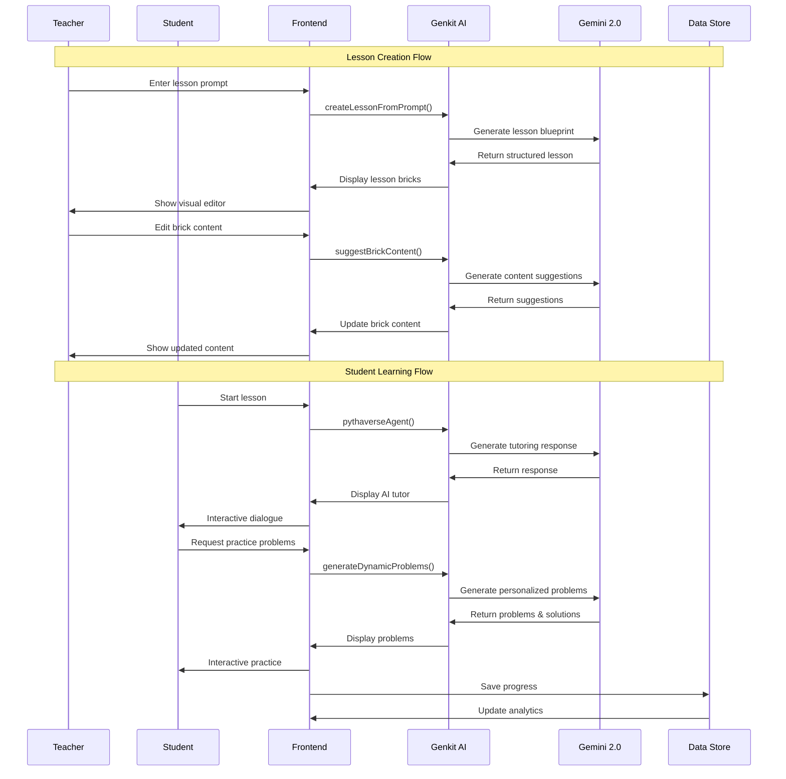
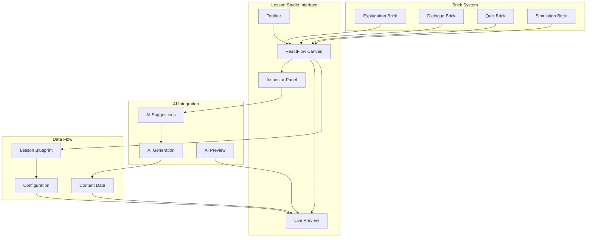
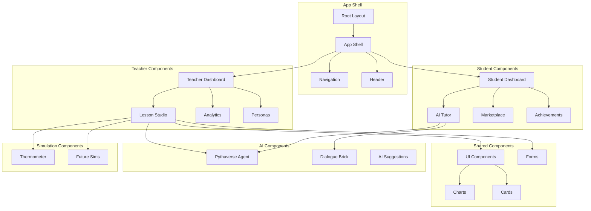
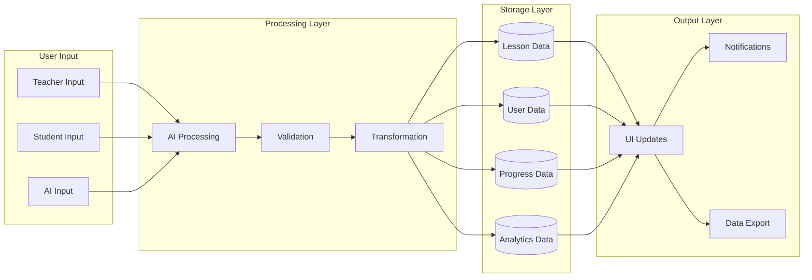
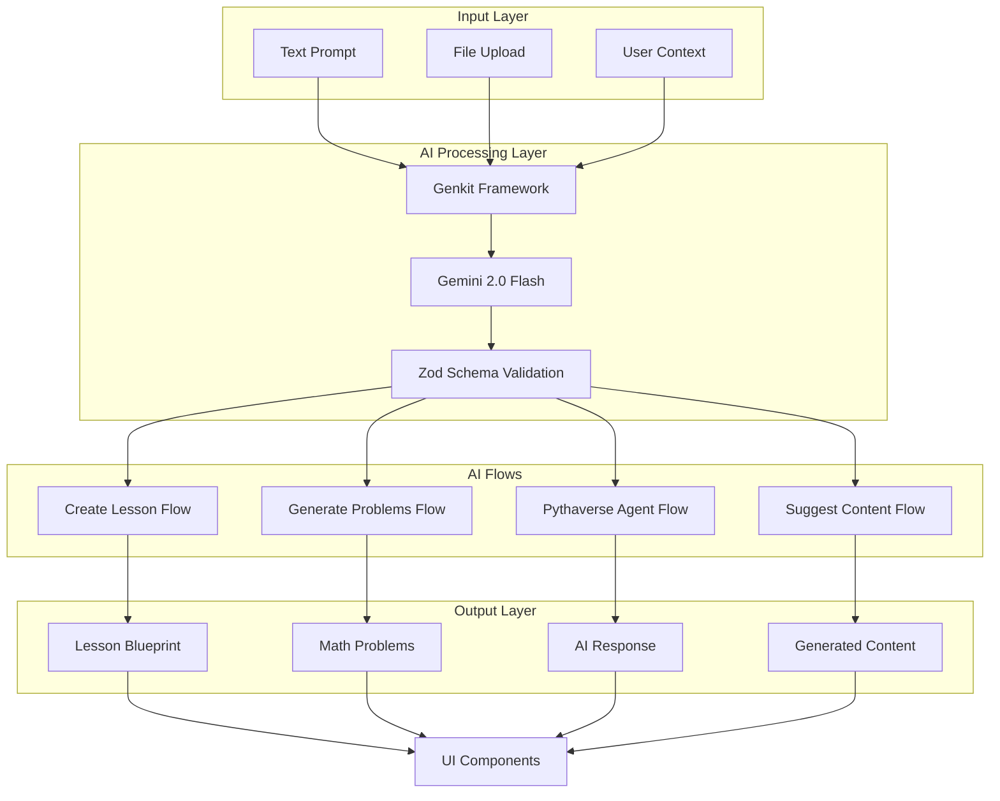
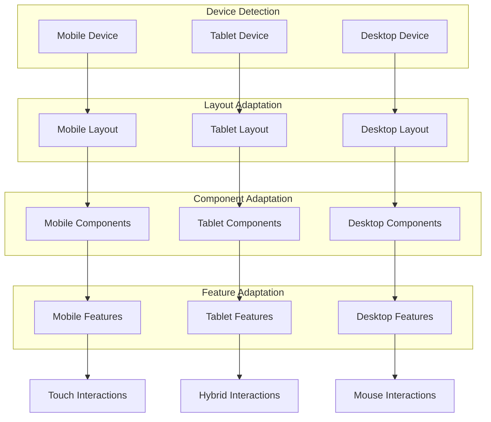
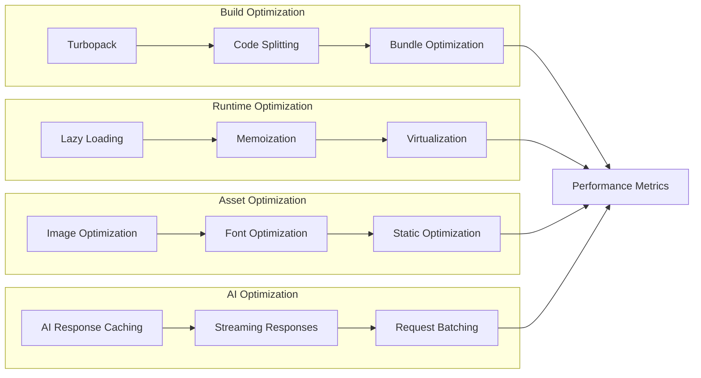

# MathMinds Project Structure

## Overview
MathMinds is a Next.js 15 application built with TypeScript, featuring an AI-powered math learning platform with personalized content generation, interactive simulations, and a marketplace for educational content.


## **MathMinds Project Overview**

MathMinds is a sophisticated AI-powered math learning platform built with modern web technologies. The project demonstrates excellent architecture and organization:

### **Key Architectural Highlights:**

1. **AI-First Design**: The application is built around AI capabilities using Google's Gemini 2.0 Flash model through the Genkit framework, with four specialized AI flows for different educational tasks.

2. **Visual Lesson Builder**: A sophisticated ReactFlow-based studio where teachers can create interactive lessons using a "brick" system (Explanation, Dialogue, Quiz, Simulation).

3. **Dual User Interface**: Separate interfaces for teachers (content creation, analytics) and students (learning, achievements, marketplace).

4. **Modern Tech Stack**: Next.js 15 with App Router, TypeScript, Tailwind CSS, and a comprehensive component library.

### **Core Features:**

- **AI Content Generation**: Automatically creates lesson blueprints from text prompts
- **Dynamic Problem Generation**: Personalized math problems based on skill level
- **Interactive Simulations**: Visual math tools (currently thermometer simulation)
- **Conversational AI**: Pythaverse agent for student-teacher interactions
- **Visual Studio**: Drag-and-drop lesson building with AI assistance
- **Progress Tracking**: Comprehensive analytics and achievement systems

### **Design System:**

The application follows a well-defined design system with:
- Custom color palette (blue primary, cyan accent)
- Typography system (Space Grotesk for headlines, Inter for body)
- Comprehensive component library (30+ shadcn/ui components)
- Dark mode support
- Responsive design

### **Development Quality:**

- TypeScript with strict type checking
- Server-side AI processing with Next.js server actions
- Comprehensive error handling and validation
- Modular component architecture
- Clean separation of concerns

The project structure shows a mature, production-ready application with excellent scalability potential and modern development practices. The AI integration is particularly sophisticated, with multiple specialized flows for different educational use cases.

## Technology Stack

### Core Technologies
- **Framework**: Next.js 15.3.3 with App Router
- **Language**: TypeScript 5
- **Styling**: Tailwind CSS 3.4.1 with custom design system
- **UI Components**: Radix UI primitives with custom shadcn/ui components
- **AI Integration**: Google AI (Gemini 2.0 Flash) via Genkit framework
- **State Management**: React hooks and server actions
- **Flow Editor**: ReactFlow for lesson building
- **Charts**: Recharts for data visualization
- **Forms**: React Hook Form with Zod validation

### Key Dependencies
- **AI/ML**: `@genkit-ai/googleai`, `@genkit-ai/next`, `genkit`
- **UI Framework**: `@radix-ui/*` components, `lucide-react` icons
- **Forms**: `react-hook-form`, `@hookform/resolvers`, `zod`
- **Flow Editor**: `reactflow`, `react-use-measure`
- **Charts**: `recharts`
- **Utilities**: `clsx`, `tailwind-merge`, `date-fns`

## Project Architecture

### Directory Structure

```
MathMinds/
├── src/
│   ├── ai/                          # AI/ML functionality
│   │   ├── flows/                   # Genkit AI flows
│   │   │   ├── create-lesson-from-prompt.ts
│   │   │   ├── generate-dynamic-problems.ts
│   │   │   ├── pythaverse-agent.ts
│   │   │   └── suggest-brick-content.ts
│   │   ├── dev.ts                   # Development AI setup
│   │   └── genkit.ts                # Genkit configuration
│   ├── app/                         # Next.js App Router pages
│   │   ├── (auth)/                  # Authentication pages
│   │   │   ├── login/
│   │   │   └── signup/
│   │   ├── educators/               # Educator landing page
│   │   ├── pricing/                 # Pricing page
│   │   ├── students/                # Student landing page
│   │   ├── teacher/                 # Teacher dashboard & tools
│   │   │   ├── analytics/           # Analytics dashboard
│   │   │   ├── create/              # Lesson creation
│   │   │   ├── dashboard/           # Teacher dashboard
│   │   │   ├── edit/                # Lesson editing
│   │   │   ├── personas/            # AI persona management
│   │   │   ├── preview/             # Lesson preview
│   │   │   ├── publish/             # Lesson publishing
│   │   │   └── studio/              # Visual lesson builder
│   │   ├── student/                 # Student learning interface
│   │   │   ├── achievements/        # Student achievements
│   │   │   ├── dashboard/           # Student dashboard
│   │   │   ├── marketplace/         # Content marketplace
│   │   │   └── tutor/               # AI tutoring sessions
│   │   ├── globals.css              # Global styles
│   │   ├── layout.tsx               # Root layout
│   │   └── page.tsx                 # Landing page
│   ├── components/                  # Reusable components
│   │   ├── shared/                  # Shared components
│   │   │   ├── app-shell.tsx        # Main app layout
│   │   │   ├── auth-form.tsx        # Authentication forms
│   │   │   ├── dialogue-brick.tsx   # Dialogue component
│   │   │   ├── header.tsx           # Site header
│   │   │   ├── lesson-card.tsx      # Lesson display cards
│   │   │   ├── progress-chart.tsx   # Progress visualization
│   │   │   └── pythaverse-agent.tsx # AI agent interface
│   │   ├── simulations/             # Interactive simulations
│   │   │   └── thermometer.tsx      # Temperature simulation
│   │   ├── studio/                  # Lesson building tools
│   │   │   ├── brick-nodes.tsx      # Flow editor nodes
│   │   │   ├── debug-view.tsx       # AI debugging interface
│   │   │   └── lesson-studio.tsx    # Main studio component
│   │   ├── ui/                      # Base UI components (shadcn/ui)
│   │   │   ├── accordion.tsx
│   │   │   ├── alert-dialog.tsx
│   │   │   ├── button.tsx
│   │   │   ├── card.tsx
│   │   │   ├── dialog.tsx
│   │   │   ├── form.tsx
│   │   │   ├── input.tsx
│   │   │   ├── select.tsx
│   │   │   ├── tabs.tsx
│   │   │   └── ... (30+ components)
│   │   └── logo.tsx                 # Application logo
│   ├── data/                        # Static data and mock content
│   │   ├── index.ts                 # Data exports
│   │   ├── lessons.json             # Sample lesson data
│   │   └── pricing.json             # Pricing information
│   ├── hooks/                       # Custom React hooks
│   │   ├── use-mobile.tsx           # Mobile detection
│   │   └── use-toast.ts             # Toast notifications
│   └── lib/                         # Utility libraries
│       ├── types.ts                 # TypeScript type definitions
│       └── utils.ts                 # Utility functions
├── static/                          # Static assets
├── docs/                            # Documentation
├── blueprint.md                     # Project requirements
├── components.json                  # shadcn/ui configuration
├── next.config.ts                   # Next.js configuration
├── package.json                     # Dependencies and scripts
├── postcss.config.mjs               # PostCSS configuration
├── tailwind.config.ts               # Tailwind CSS configuration
└── tsconfig.json                    # TypeScript configuration
```

## Core Features & Components

### 1. AI-Powered Content Generation
**Location**: `src/ai/flows/`

- **`create-lesson-from-prompt.ts`**: Generates complete lesson blueprints from text prompts
- **`generate-dynamic-problems.ts`**: Creates personalized math problems based on skill level
- **`pythaverse-agent.ts`**: Conversational AI agent for student/teacher interactions
- **`suggest-brick-content.ts`**: AI assistance for lesson content creation

### 2. Visual Lesson Builder (Studio)
**Location**: `src/components/studio/` and `src/app/teacher/studio/`

- **ReactFlow Integration**: Drag-and-drop lesson building
- **Brick System**: Four types of learning components:
  - **Explanation**: Text-based content
  - **Dialogue**: Interactive conversations
  - **Quiz**: Assessment questions
  - **Simulation**: Interactive visualizations
- **AI Integration**: Content suggestions and auto-generation
- **Real-time Preview**: Live lesson preview during creation

### 3. Interactive Simulations
**Location**: `src/components/simulations/`

- **Thermometer Simulation**: Temperature-based math concepts
- **Extensible System**: Framework for adding new simulations
- **Responsive Design**: Works across devices

### 4. User Interface System
**Location**: `src/components/ui/` and `src/components/shared/`

- **Design System**: Consistent color palette and typography
- **Component Library**: 30+ reusable UI components
- **Responsive Layout**: Mobile-first design approach
- **Accessibility**: ARIA-compliant components

### 5. User Roles & Dashboards

#### Teacher Interface (`src/app/teacher/`)
- **Dashboard**: Overview of lessons and student progress
- **Studio**: Visual lesson builder
- **Analytics**: Student performance insights
- **Personas**: AI character management
- **Marketplace**: Content monetization

#### Student Interface (`src/app/student/`)
- **Dashboard**: Personalized learning overview
- **Tutor**: AI-powered learning sessions
- **Marketplace**: Browse and purchase content
- **Achievements**: Progress tracking and badges

## Design System

### Color Palette
- **Primary**: HSL(220, 70%, 50%) - Bright blue for trust and clarity
- **Background**: HSL(220, 20%, 95%) - Light gray for clean backdrop
- **Accent**: HSL(190, 60%, 45%) - Vibrant cyan for interactive elements
- **Dark Mode**: Comprehensive dark theme support

### Typography
- **Headlines**: Space Grotesk (sans-serif)
- **Body Text**: Inter (sans-serif)
- **Monospace**: For numerical displays and code

### Component Patterns
- **Cards**: Information containers with consistent spacing
- **Buttons**: Multiple variants (primary, secondary, ghost, outline)
- **Forms**: Consistent input styling with validation
- **Navigation**: Sidebar-based navigation with active states

## Data Flow

### Lesson Creation Flow
1. Teacher enters lesson prompt in Studio
2. AI generates lesson blueprint with bricks
3. Teacher refines content using visual editor
4. AI suggests improvements and content
5. Lesson is previewed and published
6. Students access through marketplace or direct assignment

### Student Learning Flow
1. Student accesses personalized dashboard
2. AI recommends lessons based on progress
3. Student engages with interactive content
4. Progress is tracked and visualized
5. Achievements are unlocked
6. AI provides adaptive tutoring

## AI Integration Architecture

### Genkit Framework
- **Model**: Google AI Gemini 2.0 Flash
- **Flows**: Structured AI workflows with input/output schemas
- **Server Actions**: Next.js server-side AI processing
- **Type Safety**: Zod schema validation

### AI Capabilities
- **Content Generation**: Dynamic lesson creation
- **Problem Generation**: Personalized math problems
- **Conversational AI**: Interactive tutoring
- **Content Suggestions**: AI-assisted lesson building

## Development Workflow

### Scripts
- `npm run dev`: Development server with Turbopack
- `npm run genkit:dev`: AI development server
- `npm run build`: Production build
- `npm run lint`: Code linting
- `npm run typecheck`: TypeScript validation

### Configuration
- **Next.js**: Optimized for performance and SEO
- **TypeScript**: Strict type checking enabled
- **Tailwind**: Custom design system integration
- **ESLint**: Code quality enforcement

## Deployment & Hosting

### Environment Setup
- **Port**: 9002 (development)
- **Build**: Optimized for production deployment
- **Static Assets**: Optimized image handling
- **API Routes**: Server-side AI processing

### Performance Optimizations
- **Turbopack**: Fast development builds
- **Code Splitting**: Automatic route-based splitting
- **Image Optimization**: Next.js image optimization
- **Bundle Analysis**: Optimized dependency management

## Future Enhancements

### Planned Features
- **Additional Simulations**: More interactive math visualizations
- **Advanced Analytics**: Detailed learning insights
- **Collaborative Features**: Multi-user lesson creation
- **Mobile App**: Native mobile experience
- **API Integration**: Third-party educational tools

### Scalability Considerations
- **Database Integration**: Persistent data storage
- **User Authentication**: Secure user management
- **Content Management**: Advanced lesson organization
- **Performance Monitoring**: Real-time analytics

This structure provides a solid foundation for an AI-powered educational platform with modern web technologies, comprehensive AI integration, and a scalable architecture for future growth. 

# MathMinds Design Flow Diagrams

## 1. Application Architecture Overview
- Shows the layered architecture with Frontend, AI, Data, and Components layers
- Illustrates how different parts of the system interact



## 2. User Journey Flow

- Maps the complete user experience for both teachers and students
- Shows decision points and user pathways through the application


## 3. AI Integration Flow

- Detailed sequence diagram showing how AI processes user requests
- Covers both lesson creation and student learning flows


## 4. Lesson Studio Component Flow

- Visualizes the ReactFlow-based lesson builder
- Shows how the brick system and AI integration work together


## 5. Component Architecture

- Hierarchical view of all major components
- Shows relationships between different component categories


## 6. Data Flow Architecture

- Illustrates how data moves through the system
- Shows input, processing, storage, and output layers


## 7. Authentication & Authorization Flow
- User access control and role-based permissions
- Security flow from login to feature access


## 8. AI Flow Detailed Architecture
- Deep dive into the AI processing pipeline
- Shows how Genkit and Gemini work together


## 9. Responsive Design Flow
- How the application adapts to different devices
- Component and feature adaptation strategies


## 10. Performance Optimization Flow
- Build-time and runtime optimizations
- Asset and AI response optimization strategies


These diagrams provide a comprehensive view of the MathMinds application's design flow, covering architecture, user journeys, AI integration, component structure, data flow, authentication, responsive design, and performance optimization. Each diagram focuses on different aspects of the system to help understand the overall design and implementation approach. 


