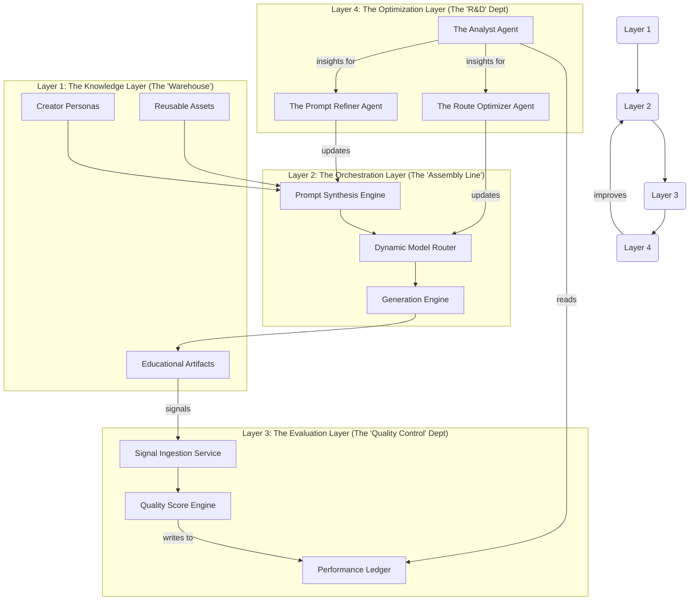

## **The Brainstorming Framework: Designing the Sentient Factory**

Our discussion will be structured around four interconnected layers. We will start at the bottom (the foundation) and work our way up to the most advanced concepts (the learning agents). For each layer, I will present the core concepts and then pose key questions for us to tackle together.

### **Diagram: The Four Layers of the Sentient Factory**

---

### **Our Collaborative Workflow**

We will proceed through these layers step-by-step.

1.  **Foundational Agreement:** We first agree on this four-layer framework as our shared map.
2.  **Deep Dive Sessions:** We dedicate a "session" (which could be a series of back-and-forths) to each layer, starting with Layer 1.
3.  **Research Spikes:** For open questions, we'll define "research spikes" to investigate existing practices (e.g., looking at frameworks like LangChain/LangGraph, model routing techniques, or agent-based architectures).
4.  **Architect & Prototype:** After discussing a layer, we'll translate our ideas into a formal architecture diagram and potentially a small Proof-of-Concept (PoC).
5.  **Refine the Roadmap:** Finally, we will update our core architecture documents to reflect the new, next-generation design.

Let's begin.

---

### **Layer 1: The Knowledge Layer (The Warehouse)**

This is the foundation. It's about what we *know*. Before we can optimize anything, we need structured, high-quality data.

*   **Core Concepts:**
    *   **Creator Persona (`CreatorPersona`):** More than just a name. It includes the creator's expertise, their preferred teaching style (e.g., Socratic, humorous, direct), and their target audience. This is a key input for prompt generation.
    *   **Reusable Asset (`ReusableAsset`):** A creator can upload their own assets (case studies, code snippets, proprietary data) that can be referenced by the AI during generation.
    *   **Educational Artifact (`EducationalArtifact`):** The final output, composed of versioned bricks.
    *   **Performance Ledger (`PerformanceLedger`):** **This is a critical new concept.** It's an immutable log that records the performance of every single generative step.
        *   *Schema Idea:* `{ generationId, brickId, fmUsed, fmParameters, promptHash, latencyMs, costUsd, creatorAction (enum: ACCEPTED, REJECTED, REMIXED), studentQualityScore, timestamp }`

*   **Let's Brainstorm:**
    1.  **Creator Personas:** How do we capture a "teaching style" in a way an AI can use? Should we have them provide examples of their writing? Should we have them select from a list of archetypes?
    2.  **Asset Management:** How do we make assets available to the FMs? Fine-tuning? Retrieval-Augmented Generation (RAG)? How do we ensure privacy?
    3.  **Performance Ledger:** Is the proposed schema sufficient? What else do we need to track to make smart decisions later?

### **Layer 2: The Orchestration Layer (The Assembly Line)**

This layer is the evolution of our `AI Orchestrator`. It's responsible for the end-to-end process of creating an EA.

*   **Core Concepts:**
    *   **Deconstruction:** The system takes the creator's high-level intent (e.g., "a lesson on Python list comprehensions for beginners") and breaks it into a structured EA blueprint (e.g., `[Introduction_Brick, Explanation_Brick, Example_Brick, Quiz_Brick]`).
    *   **Dynamic Model Router (`DMR`):** This is the heart of the chimera. For each brick in the blueprint, the DMR decides **which FM to use**. Its decision is based on a routing table that considers:
        *   Brick Type (e.g., `code-generation`, `image-creation`, `quiz-multiple-choice`).
        *   Required Quality (e.g., "draft" vs. "final polish").
        *   Cost constraints.
        *   Performance data from the `PerformanceLedger`.
    *   **Prompt Synthesis:** This engine takes the output of the DMR and assembles the final prompt, injecting the creator's persona, relevant reusable assets, and platform-wide best practices.
    *   **Generation Engine:** The component that actually makes the API calls to the chosen FMs, handling things like retries and fallbacks.

*   **Let's Brainstorm:**
    1.  **The Router's Logic:** What does the initial routing table look like? Do we start with simple rules (e.g., "Always use OpenAI's DALL-E for images, always use Gemini Pro for code") and let the agents improve it over time?
    2.  **Fallback Strategies:** What happens if the "best" model (e.g., GPT-4o) is slow or down? Does the DMR automatically fallback to a faster, cheaper model like Grok's LPU or Gemini Flash?
    3.  **Cost vs. Quality:** Should we allow creators to set a "budget" or "quality" slider for a generation, which would directly influence the DMR's choices?

### **Layer 3: The Evaluation Layer (The Quality Control Dept)**

This layer's sole purpose is to observe and measure the results of the Orchestration Layer. It feeds the brain.

*   **Core Concepts:**
    *   **Signal Ingestion Service:** A dedicated endpoint or event consumer that collects all feedback signals:
        *   **Creator Signals (Explicit):** Remix count, time-to-acceptance, direct ratings on a generation.
        *   **Student Signals (Explicit):** Lesson ratings, feedback on specific bricks.
        *   **Implicit Signals:** Engagement time on a brick, completion rates, drop-off points.
    *   **Quality Score Engine:** This engine's job is to fuse these disparate signals into a single, normalized `studentQualityScore` for each generated brick. This score is what gets written to the `PerformanceLedger`.
    *   **Attribution:** It's crucial that we can attribute the final quality score back to the specific `generationId` and the `fmUsed` that created the content.

*   **Let's Brainstorm:**
    1.  **Signal Weighting:** How do we weigh these signals? Is a creator's "REJECTED" action a stronger negative signal than a low student rating? This is a key product and data science question.
    2.  **Attribution Challenge:** If a creator remixes a brick three times using three different models, how do we attribute the final "ACCEPTED" state? Does the credit go to the last model, or all three in the chain?
    3.  **Calculating the Score:** What algorithm do we use for the `QualityScore`? Is it a simple weighted average? A more complex regression model?

### **Layer 4: The Optimization Layer (The R&D Dept)**

This is the most advanced layer. It contains the autonomous agents that learn from the `PerformanceLedger` and actively re-tool the `Orchestration Layer`.

*   **Core Agent Ideas:**
    1.  **The `Analyst Agent`:** This is a read-only agent. Its job is to constantly scan the `PerformanceLedger` and find statistically significant correlations. It doesn't make changes; it produces *insights*.
        *   *Example Insight:* "I have observed with 95% confidence that for the `quiz-multiple-choice` brick type, `Claude 3 Sonnet` has a 20% higher `studentQualityScore` and is 15% cheaper than `Gemini Pro`."
    2.  **The `Route Optimizer Agent`:** This agent consumes the insights from the `Analyst Agent`. Its job is to **propose and execute changes to the Dynamic Model Router's routing table**.
        *   *Example Action:* "Based on Insight #123, I am updating the primary route for `quiz-multiple-choice` to `Claude 3 Sonnet`."
    3.  **The `Prompt Refiner Agent` (Meta-Optimization):** The most sophisticated agent. It doesn't change the *routes*; it changes the *prompts*. It experiments by making small modifications to the master prompts stored in the `Prompt Management Service`.
        *   *Example Experiment:* "I hypothesize that adding the phrase 'Assume you are an expert instructional designer' to the system prompt for `Explanation_Brick` will increase the quality score. I will run an A/B test on 1% of new generations to validate this."

*   **Let's Brainstorm:**
    1.  **Safety and Control:** How do we prevent these agents from making bad changes? Do their proposed changes require human approval? Or do we A/B test their changes on a small percentage of traffic first and automatically roll back if the `QualityScore` drops?
    2.  **Agent Triggers:** What triggers these agents? Do they run on a schedule (e.g., every night)? Are they triggered by specific events (e.g., after 1,000 new data points are logged)?
    3.  **The Cost of Optimization:** These agents themselves consume compute. How do we balance the cost of running the optimization agents against the value they provide in cost savings and quality improvements?

This framework gives us a structured path to design something truly groundbreaking. I'm ready to dive into Layer 1 with you whenever you are. What are your initial thoughts on the `Knowledge Layer`?
