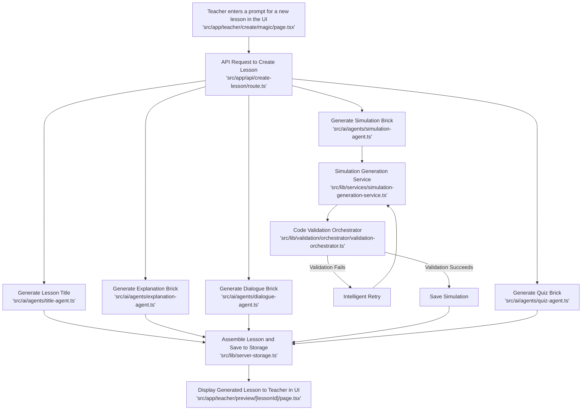
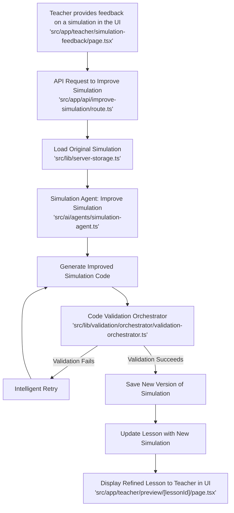

# AI Content Generation Flow

This document outlines the complete flow of how the MathMind application uses AI to generate educational content "bricks." It details the process for each brick type and explains the mechanisms in place to ensure the generation of high-quality, validated, and effective learning experiences for the user.

## Core Principles for Quality Assurance

The entire AI generation process is built on a foundation of principles designed to guarantee a high-quality outcome. These principles are applied at every stage of the generation flow:

1.  **Centralized Logic and Configuration:** All AI-powered generation is managed through centralized services (`SimulationGenerationService`, `AIModelManager`, `ConfigurationService`). This ensures that every piece of content is created using a consistent, predictable, and manageable process.

2.  **Prompt Engineering and Contextualization:** We don't just ask the AI to "create a math lesson." Before any generation occurs, the system extracts a rich `LessonContext` that includes the topic, subtopics, grade level, learning objectives, and even the desired teaching style. This context is used to create highly specific, targeted prompts that guide the AI toward generating pedagogically sound and relevant content.

3.  **Integrated Validation and Scoring:** For complex content like simulations, we don't blindly trust the AI's output. The `CodeValidationOrchestrator` automatically inspects every generated simulation for:
    *   **Syntax and Type Errors:** Is the code valid and well-formed?
    *   **Security Vulnerabilities:** Does the code contain any potential security risks?
    *   **Educational Quality:** Does the code meet our standards for a high-quality educational experience?

    Only simulations that pass a minimum quality score are allowed to proceed.

4.  **Intelligent Retries and Self-Correction:** If a generated simulation fails validation, the system doesn't just give up. It analyzes the validation feedback, intelligently adjusts the AI prompt to address the specific errors, and tries again. This self-correction mechanism significantly increases the success rate and the overall quality of the generated content.

5.  **Robust Fallback Mechanisms:** In the rare event that the AI fails to generate a satisfactory piece of content after multiple attempts, the system gracefully falls back to a high-quality, human-vetted alternative. This ensures that the user experience is never interrupted by a generation failure.

## Brick-by-Brick Generation Flow

Here is a detailed breakdown of the generation flow for each type of educational brick:

### 1. Explanation Brick

**Agent:** `explanation-agent.ts`

1.  **Context Extraction:** The agent starts by extracting a detailed `LessonContext` from the user's prompt and lesson specifications.
2.  **Prompt Generation:** It then retrieves a centralized prompt template for generating explanations and injects the `LessonContext` into it. This creates a highly specific prompt that guides the AI to generate an explanation that is tailored to the user's needs.
3.  **AI Model Execution:** The agent uses the `AIModelManager` to execute the prompt. The manager intelligently selects the best AI model for the job and includes a fallback mechanism to ensure a response is always generated.
4.  **Type-Safe Output:** The agent ensures that the generated content conforms to the `ExplanationBrickSchema`, guaranteeing a consistent data structure.
5.  **Fallback:** If the generation fails, a simple but effective fallback explanation is generated to ensure the lesson flow is not interrupted.

### 2. Dialogue Brick

**Agent:** `dialogue-agent.ts`

The generation flow for the Dialogue Brick is very similar to the Explanation Brick, with a few key differences:

1.  **Specialized Prompt:** The agent uses a prompt template that is specifically designed to generate engaging and educational conversations.
2.  **Conversational Structure:** The `DialogueBrickSchema` ensures that the generated content includes a clear conversational structure, with distinct lines for the tutor and the student.
3.  **Interactive Dialogue Function:** The agent also includes a separate `interactiveDialogue` function that can be used for real-time, back-and-forth conversations with the user. This function uses a more dynamic prompt that takes the conversation history into account.

### 3. Simulation Brick

**Agent:** `simulation-agent.ts`
**Service:** `simulation-generation-service.ts`

The generation of a Simulation Brick is the most complex and robust process in the system:

1.  **Centralized Service:** The `simulation-agent` doesn't generate the simulation itself. Instead, it delegates this task to the `SimulationGenerationService`, ensuring that all simulations are created using the same high-quality process.
2.  **Configuration-Driven Generation:** The `SimulationGenerationService` retrieves its configuration from the `ConfigurationService`. This allows us to define different generation parameters (e.g., AI model, temperature, retry attempts) for different difficulty levels, ensuring that the generated simulation is perfectly tailored to the user's needs.
3.  **Rigorous Validation:** Once the simulation code is generated, it is immediately passed to the `CodeValidationOrchestrator`, which performs a comprehensive analysis of its quality, security, and correctness.
4.  **Iterative Improvement:** If the simulation fails validation, the service uses the validation feedback to generate a new, improved prompt and tries again. This iterative process of generation and validation is the key to producing high-quality, error-free simulations.
5.  **Guaranteed Fallback:** If all generation attempts fail, the service uses the `FallbackService` to provide a proven, high-quality, human-vetted simulation. This guarantees that the user always has a high-quality interactive experience.

### 4. Quiz Brick

**Agent:** `quiz-agent.ts`

The generation flow for the Quiz Brick is designed to produce effective and relevant assessments:

1.  **Context-Aware Questions:** The `quiz-agent` uses the `LessonContext` to generate questions that are directly related to the learning objectives of the lesson.
2.  **Structured Output:** The `QuizBrickSchema` ensures that the generated content includes a clear question, a set of options, and the correct answer, making it easy to render as an interactive quiz.
3.  **Assessment-Focused Prompt:** The agent uses a prompt template that is specifically designed to generate high-quality assessment questions that accurately measure the user's understanding of the topic.

By following these rigorous, multi-layered processes, the MathMind application is able to leverage the power of AI to generate a wide variety of educational content while still maintaining the highest standards of quality, safety, and pedagogical effectiveness.

## Visual Workflow Diagrams

To provide a clearer picture of the end-to-end process, here are two Mermaid diagrams illustrating the lesson creation and refinement workflows from the perspective of a teacher using the MathMind application.

### Lesson Creation Workflow

This diagram shows the process of a teacher creating a new lesson from scratch.

### Lesson Refinement Workflow

This diagram illustrates how a teacher can refine and improve an existing lesson.

