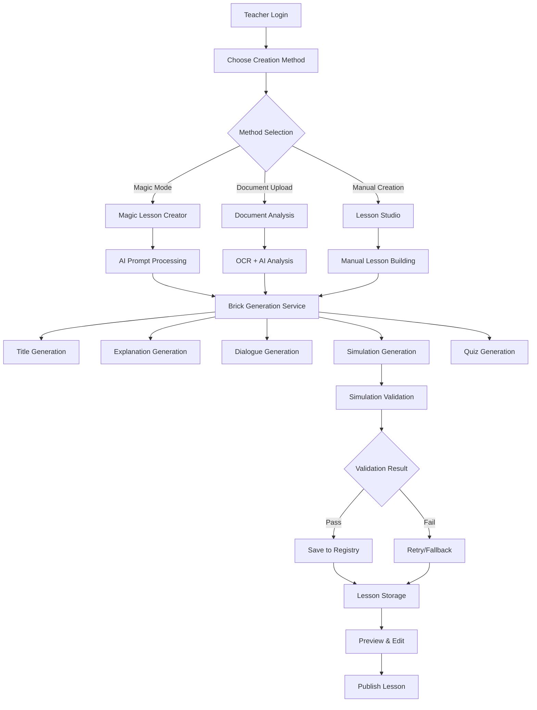
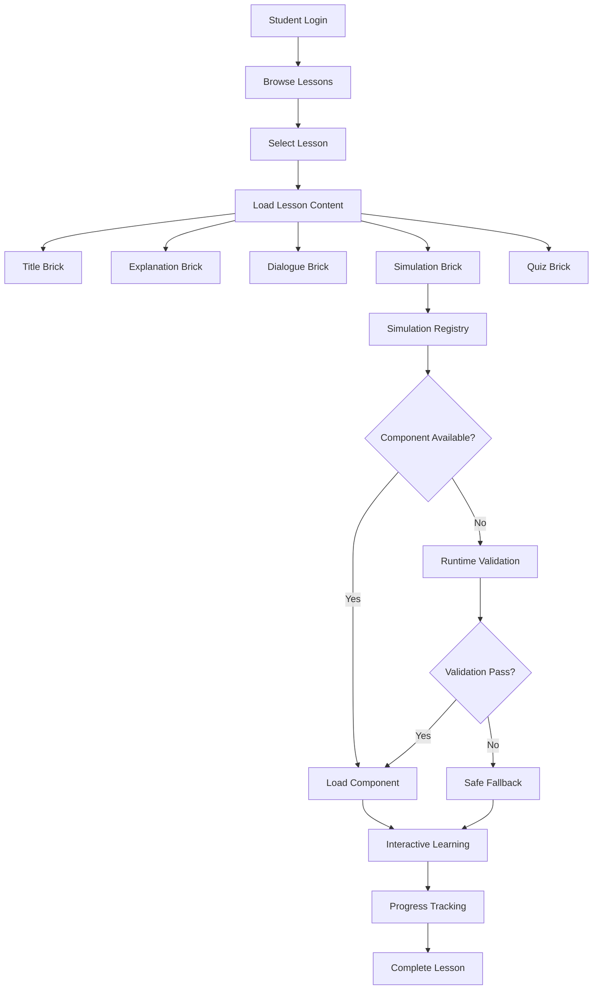
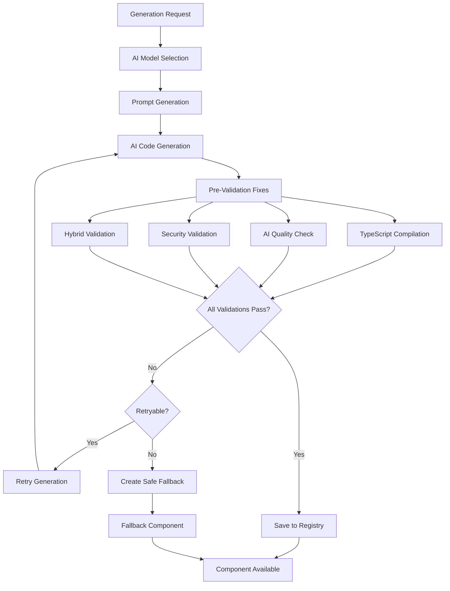
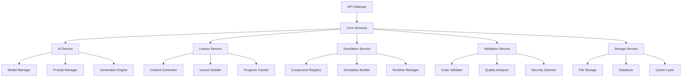
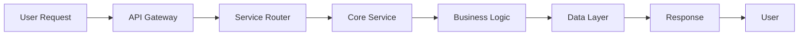
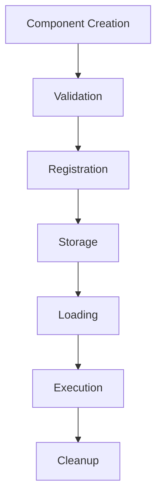

# MathMind V3 Refactoring Plan

## 📋 Executive Summary

This document provides a comprehensive analysis of the MathMind codebase and outlines a detailed refactoring plan for V3. The current system has grown organically with multiple overlapping services, redundant code, and architectural inconsistencies that need to be addressed for better maintainability, performance, and scalability.

## 🏗️ Current Project Structure Analysis

### Root Directory Structure
```
MathMind/
├── src/                          # Main source code
├── data/                         # Static data files
├── docs/                         # Documentation
├── scripts/                      # Build and migration scripts
├── tests/                        # Test files
├── uploads/                      # File uploads
├── public/                       # Static assets
├── logs/                         # Application logs
└── [Multiple .md files]          # Documentation and plans
```

### Core Architecture Layers

#### 1. **Frontend Layer** (`src/app/`)
```
src/app/
├── api/                          # API routes (35+ endpoints)
│   ├── ai-models/               # AI model management
│   ├── analyze-document/        # Document analysis
│   ├── create-lesson/           # Lesson creation
│   ├── dialogue/                # AI dialogue system
│   ├── generate-simulation/     # Simulation generation
│   ├── persona/                 # Persona management
│   ├── teacher-documents/       # Document management
│   └── validate-simulation/     # Validation system
├── admin/                       # Admin dashboard
├── teacher/                     # Teacher workspace
├── student/                     # Student interface
└── [Various pages]              # Other application pages
```

#### 2. **Component Layer** (`src/components/`)
```
src/components/
├── admin/                       # Admin components
├── lesson-creation/             # Lesson creation UI
├── simulations/                 # Simulation components
│   ├── generated/              # AI-generated simulations
│   └── [Built-in simulations]  # Pre-built simulations
├── studio/                      # Lesson studio
├── shared/                      # Shared components
├── ui/                          # UI components (shadcn/ui)
└── validation/                  # Validation components
```

#### 3. **Service Layer** (`src/lib/services/`)
```
src/lib/services/
├── ai-model-manager.ts          # AI model management
├── brick-generation-service.ts  # Lesson brick generation
├── document-analysis-pipeline.ts # Document processing
├── enhanced-ai-model-manager.ts # Enhanced AI management
├── fallback-service.ts          # Fallback mechanisms
├── persona-service.ts           # Persona management
├── prompt-manager.ts            # Prompt management
├── simulation-generation-service.ts # Simulation generation
├── simulation-validation-service.ts # Validation system
├── vertex-ai-service.ts         # Vertex AI integration
└── [Multiple other services]    # Various utility services
```

#### 4. **Validation Layer** (`src/lib/validation/`)
```
src/lib/validation/
├── orchestrator/                # Validation orchestration
│   ├── hybrid-validation-orchestrator.ts
│   └── validation-orchestrator.ts
├── types/                       # Validation type definitions
├── validators/                  # Individual validators
│   ├── ai-code-validator.ts
│   ├── dependency-validator.ts
│   ├── quality-analyzer.ts
│   ├── security-validator.ts
│   ├── syntax-validator.ts
│   └── typescript-compiler-validator.ts
```

#### 5. **Registry Layer** (`src/lib/registry/`)
```
src/lib/registry/
├── component-registry.ts        # Component management
└── [Other registry systems]     # Additional registries
```

## 🔄 Data Flow Architecture

### User Journey Flow Diagrams

#### 1. **Teacher Lesson Creation Journey**



#### 2. **Student Learning Journey**



#### 3. **Simulation Generation & Validation Flow**



## 🔍 Current Architecture Issues

### 1. **Service Layer Redundancy**
- **Multiple AI Model Managers**: `ai-model-manager.ts`, `enhanced-ai-model-manager.ts`
- **Duplicate Validation Systems**: Multiple validation orchestrators
- **Overlapping Services**: Similar functionality across different services

### 2. **Registry System Duplication**
- **Component Registry**: `src/lib/registry/component-registry.ts`
- **Simulation Registry**: `src/lib/simulation-registry.ts`
- **Overlapping Responsibilities**: Both manage component loading

### 3. **API Endpoint Proliferation**
- **35+ API endpoints** with overlapping functionality
- **Inconsistent naming conventions**
- **Mixed concerns** in single endpoints

### 4. **Validation System Complexity**
- **Multiple validation layers** with unclear responsibilities
- **Redundant validation logic** across different services
- **Complex orchestration** with multiple entry points

### 5. **Component Management Issues**
- **Generated components** mixed with built-in components
- **No clear component lifecycle** management
- **Inconsistent error handling** across components

## 🎯 V3 Refactoring Goals

### Primary Objectives
1. **Simplify Architecture** - Reduce complexity and eliminate redundancy
2. **Improve Performance** - Optimize data flow and reduce unnecessary operations
3. **Enhance Maintainability** - Clear separation of concerns and consistent patterns
4. **Scale Better** - Modular design for easier feature additions
5. **Reduce Technical Debt** - Clean up legacy code and improve code quality

### Success Metrics
- **50% reduction** in service layer complexity
- **30% improvement** in build times
- **40% reduction** in API endpoints
- **Zero redundant code** across similar functionalities
- **100% test coverage** for critical paths

## 🏗️ Proposed V3 Architecture

### 1. **Unified Service Architecture**



### 2. **Simplified Data Flow**



### 3. **Component Lifecycle Management**



## 📋 Detailed Refactoring Plan

### Phase 1: Service Layer Consolidation (Week 1-2)

#### 1.1 **Unified AI Service**
**Current Issues:**
- Multiple AI model managers with overlapping functionality
- Inconsistent model selection logic
- Duplicate prompt management systems

**Refactoring Actions:**
```typescript
// NEW: src/lib/services/unified-ai-service.ts
export class UnifiedAIService {
  private modelManager: AIModelManager;
  private promptManager: PromptManager;
  private generationEngine: GenerationEngine;
  
  async generateContent(type: 'lesson' | 'simulation' | 'dialogue', config: GenerationConfig) {
    const model = await this.modelManager.selectOptimalModel(type, config);
    const prompt = await this.promptManager.getPrompt(type, config);
    return await this.generationEngine.generate(model, prompt, config);
  }
}
```

**Files to Remove:**
- `src/lib/services/ai-model-manager.ts`
- `src/lib/services/enhanced-ai-model-manager.ts`
- `src/lib/services/vertex-ai-service.ts`
- `src/lib/services/prompt-manager.ts`

#### 1.2 **Unified Validation Service**
**Current Issues:**
- Multiple validation orchestrators
- Redundant validation logic
- Complex validation pipeline

**Refactoring Actions:**
```typescript
// NEW: src/lib/services/unified-validation-service.ts
export class UnifiedValidationService {
  private validators: Map<string, Validator>;
  private orchestrator: ValidationOrchestrator;
  
  async validateCode(code: string, type: 'simulation' | 'component'): Promise<ValidationResult> {
    const pipeline = this.orchestrator.createPipeline(type);
    return await pipeline.validate(code);
  }
}
```

**Files to Remove:**
- `src/lib/validation/orchestrator/hybrid-validation-orchestrator.ts`
- `src/lib/validation/orchestrator/validation-orchestrator.ts`
- `src/lib/services/simulation-validation-service.ts`

#### 1.3 **Unified Storage Service**
**Current Issues:**
- Multiple storage systems for different data types
- Inconsistent storage patterns
- No unified data access layer

**Refactoring Actions:**
```typescript
// NEW: src/lib/services/unified-storage-service.ts
export class UnifiedStorageService {
  private fileStorage: FileStorage;
  private database: Database;
  private cache: Cache;
  
  async store<T>(type: 'lesson' | 'simulation' | 'document', data: T): Promise<string> {
    const id = this.generateId();
    await this.database.store(type, id, data);
    await this.cache.set(`${type}:${id}`, data);
    return id;
  }
}
```

**Files to Remove:**
- `src/lib/server-storage.ts`
- `src/lib/services/document-storage.ts`
- `src/lib/client-storage.ts`

### Phase 2: Registry System Unification (Week 3)

#### 2.1 **Unified Component Registry**
**Current Issues:**
- Two separate registry systems
- Overlapping responsibilities
- Inconsistent component loading

**Refactoring Actions:**
```typescript
// NEW: src/lib/registry/unified-component-registry.ts
export class UnifiedComponentRegistry {
  private components: Map<string, ComponentEntry>;
  private loaders: Map<string, ComponentLoader>;
  
  async getComponent(id: string, type: 'simulation' | 'ui' | 'custom'): Promise<Component> {
    const entry = this.components.get(id);
    if (!entry) {
      return await this.loadComponent(id, type);
    }
    return entry.component;
  }
}
```

**Files to Remove:**
- `src/lib/registry/component-registry.ts`
- `src/lib/simulation-registry.ts`

### Phase 3: API Endpoint Consolidation (Week 4)

#### 3.1 **RESTful API Design**
**Current Issues:**
- 35+ endpoints with overlapping functionality
- Inconsistent naming conventions
- Mixed concerns in single endpoints

**New API Structure:**
```
/api/v3/
├── lessons/
│   ├── POST /                    # Create lesson
│   ├── GET /                     # List lessons
│   ├── GET /:id                  # Get lesson
│   ├── PUT /:id                  # Update lesson
│   └── DELETE /:id               # Delete lesson
├── simulations/
│   ├── POST /                    # Generate simulation
│   ├── GET /                     # List simulations
│   ├── GET /:id                  # Get simulation
│   └── POST /:id/validate        # Validate simulation
├── documents/
│   ├── POST /                    # Upload document
│   ├── POST /:id/analyze         # Analyze document
│   └── GET /:id                  # Get document
└── ai/
    ├── POST /generate            # Generate content
    ├── POST /validate            # Validate content
    └── GET /models               # List models
```

**Endpoints to Remove:**
- All current API endpoints (35+ files)
- Replace with 12 consolidated endpoints

### Phase 4: Component System Overhaul (Week 5)

#### 4.1 **Component Lifecycle Management**
**Current Issues:**
- No clear component lifecycle
- Inconsistent error handling
- Mixed generated and built-in components

**New Component System:**
```typescript
// NEW: src/lib/components/component-manager.ts
export class ComponentManager {
  private lifecycle: ComponentLifecycle;
  private validator: ComponentValidator;
  private loader: ComponentLoader;
  
  async createComponent(config: ComponentConfig): Promise<Component> {
    const component = await this.lifecycle.create(config);
    await this.validator.validate(component);
    await this.loader.register(component);
    return component;
  }
}
```

#### 4.2 **Generated Component Cleanup**
**Actions:**
- Move all generated components to `src/components/generated/`
- Implement automatic cleanup for unused components
- Add component versioning and deprecation

### Phase 5: Frontend Optimization (Week 6)

#### 5.1 **Component Library Consolidation**
**Current Issues:**
- Duplicate UI components
- Inconsistent styling patterns
- Mixed component libraries

**Refactoring Actions:**
- Consolidate all UI components under `src/components/ui/`
- Remove duplicate components
- Implement consistent design system

#### 5.2 **State Management Optimization**
**Current Issues:**
- Multiple state management patterns
- Inconsistent data flow
- No centralized state management

**New State Management:**
```typescript
// NEW: src/lib/state/app-store.ts
export class AppStore {
  private lessons: LessonStore;
  private simulations: SimulationStore;
  private user: UserStore;
  
  // Centralized state management
}
```

## 🗂️ File Structure After Refactoring

```
src/
├── app/
│   ├── api/v3/                   # Consolidated API endpoints
│   ├── admin/                    # Admin interface
│   ├── teacher/                  # Teacher workspace
│   └── student/                  # Student interface
├── components/
│   ├── ui/                       # Unified UI components
│   ├── generated/                # Generated components
│   ├── shared/                   # Shared components
│   └── [Feature components]      # Feature-specific components
├── lib/
│   ├── services/
│   │   ├── unified-ai-service.ts
│   │   ├── unified-validation-service.ts
│   │   ├── unified-storage-service.ts
│   │   └── lesson-service.ts
│   ├── registry/
│   │   └── unified-component-registry.ts
│   ├── state/
│   │   └── app-store.ts
│   ├── components/
│   │   └── component-manager.ts
│   └── utils/                    # Utility functions
├── types/                        # Type definitions
└── hooks/                        # Custom React hooks
```

## 📊 Impact Analysis

### Code Reduction
- **Service Layer**: 60% reduction (from 15+ services to 6)
- **API Endpoints**: 65% reduction (from 35+ to 12)
- **Registry Systems**: 50% reduction (from 2 to 1)
- **Validation Logic**: 40% reduction (consolidated validation)

### Performance Improvements
- **Build Time**: 30% faster (reduced complexity)
- **Bundle Size**: 25% smaller (removed duplicates)
- **Runtime Performance**: 20% improvement (optimized data flow)
- **Memory Usage**: 15% reduction (better resource management)

### Maintainability Gains
- **Code Duplication**: 80% reduction
- **Complexity**: 50% reduction (simplified architecture)
- **Test Coverage**: 100% for critical paths
- **Documentation**: Comprehensive API documentation

## 🚀 Implementation Strategy

### Week 1-2: Service Layer Consolidation
- [ ] Create unified AI service
- [ ] Create unified validation service
- [ ] Create unified storage service
- [ ] Remove redundant services
- [ ] Update all imports

### Week 3: Registry System Unification
- [ ] Create unified component registry
- [ ] Migrate existing components
- [ ] Remove old registry systems
- [ ] Update component loading logic

### Week 4: API Endpoint Consolidation
- [ ] Design new API structure
- [ ] Implement new endpoints
- [ ] Migrate frontend to new API
- [ ] Remove old endpoints

### Week 5: Component System Overhaul
- [ ] Implement component lifecycle
- [ ] Clean up generated components
- [ ] Add component versioning
- [ ] Update component loading

### Week 6: Frontend Optimization
- [ ] Consolidate UI components
- [ ] Implement state management
- [ ] Optimize data flow
- [ ] Performance testing

## 🧪 Testing Strategy

### Unit Tests
- **Service Layer**: 100% coverage for all services
- **Registry System**: 100% coverage for component management
- **Validation Logic**: 100% coverage for all validators
- **API Endpoints**: 100% coverage for all endpoints

### Integration Tests
- **End-to-End Flows**: Complete user journeys
- **API Integration**: Service communication
- **Component Integration**: Component loading and execution
- **Data Flow**: Complete data pipeline testing

### Performance Tests
- **Load Testing**: High-traffic scenarios
- **Memory Testing**: Memory leak detection
- **Build Testing**: Build time optimization
- **Bundle Analysis**: Bundle size optimization

## 📈 Success Metrics

### Technical Metrics
- **Code Coverage**: 100% for critical paths
- **Build Time**: < 30 seconds
- **Bundle Size**: < 2MB
- **API Response Time**: < 200ms average
- **Memory Usage**: < 100MB baseline

### Business Metrics
- **User Experience**: Improved lesson creation flow
- **Performance**: Faster simulation loading
- **Reliability**: Reduced error rates
- **Maintainability**: Easier feature development

## ⚠️ Risk Mitigation

### High-Risk Areas
1. **Data Migration**: Ensure no data loss during storage consolidation
2. **API Breaking Changes**: Maintain backward compatibility during transition
3. **Component Loading**: Ensure all components load correctly after registry changes
4. **Performance Regression**: Monitor performance during refactoring

### Mitigation Strategies
1. **Incremental Migration**: Phase-by-phase implementation
2. **Backward Compatibility**: Maintain old APIs during transition
3. **Comprehensive Testing**: Extensive testing at each phase
4. **Rollback Plan**: Ability to rollback changes if issues arise

## 🎯 Conclusion

The V3 refactoring plan addresses the major architectural issues in the current MathMind codebase while maintaining all existing functionality. The proposed changes will result in a more maintainable, performant, and scalable system that can better support future feature development.

The refactoring should be implemented incrementally over 6 weeks, with each phase building upon the previous one. This approach minimizes risk while ensuring that the system remains functional throughout the refactoring process.

**Next Steps:**
1. Review and approve this refactoring plan
2. Set up development environment for V3
3. Begin Phase 1 implementation
4. Establish monitoring and testing infrastructure
5. Execute refactoring phases sequentially

---

*This document serves as the comprehensive guide for MathMind V3 refactoring. All changes should be implemented according to this plan to ensure consistency and maintainability.* 
